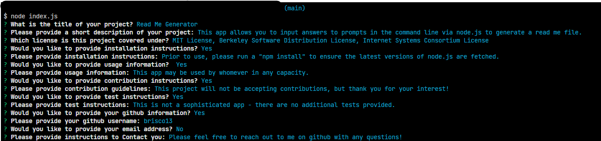

# Read Me Generator    

## Description

This app allows you to input answers to prompts in the command line via node.js to generate a read me file. 

## Table of Contents

[Installation](#installation)

[Usage](#usage)

[Contribution](#contribution)

[License](#license)

[Features](#features)

[Credits](#credits)

[Tests](#tests)

[Contact Me](#contact-me)

## Installation

 Prior to use, please run a "npm install" to ensure the latest versions of node.js are fetched.
 The program is launched by entering "node index.js" in the root folder after clone.

## Usage

 This app may be used by whomever in any capacity.

## Contribution

This project will not be accepting contributions, but thank you for your interest!

## License: 

N/A

---

## Features: 

- Simply follow the prompts to create a readme.md file:

- This read me was made with this!
- Creates a completely formatted readme.md file with prompts to improve
- Multiple license badges may be included and added to the top of your project
- Watch the video below for a walkthrough of how to use this tool!
https://user-images.githubusercontent.com/103338620/175801915-e152eb70-5f27-4325-aeb3-fc82312c9e01.mp4

## Credits: 

- Brisco Arechederra (independent Project)

## Tests

This is not a sophisticated app - there are no additional tests provided.

## Contact Me: 

Please feel free to reach out to me on github with any questions!
 
[My Github](https://github.com/brisco13)
